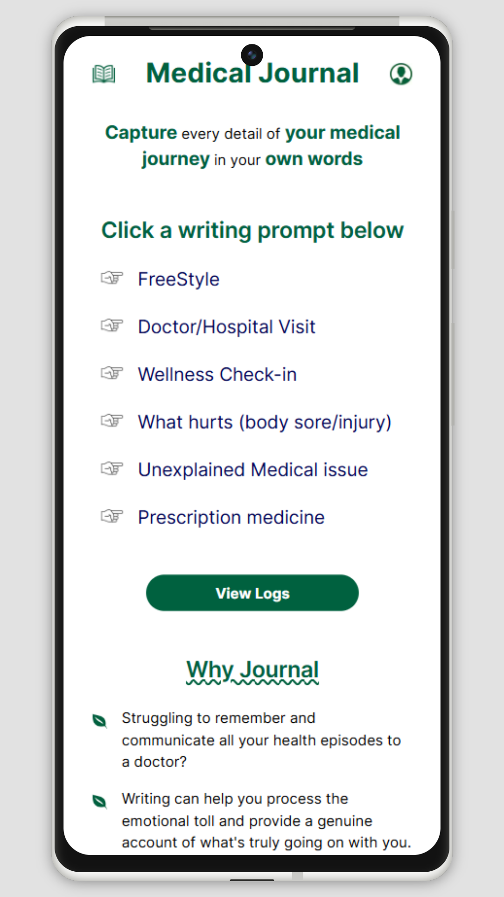

# Medical Journal

From recounting your doctor's visit to the impact of prescriptions on your well-being, this platform capture every detail in your own words. 

This project is under construction!!!!

[Click to view: Medical Journal](https://medicaljournal.netlify.app)

## Features
- TBD

## Built with
- **Next.js** is a frontend JavaScript framework, based on React but with server components/actions, used for displaying the user interface. 
- **TailwindCSS** is a CSS library utilized to quickly style the application. 
- **Jest** serves as a component testing framework. 
- **Netlify** is the hosting platform employed for hosting the application.
- **PostHog** a library that sends data to PostHog track the number of journal entries submitted.
- **CouchDB** a libray that saves data to the broswer's IndexDB.

## Get Started
1. Clone the repo
2. In the terminal for the med-journal directory, type "npm install" to install the libraries.
3. In the terminal, type "npm run dev"

## Testing
### Getting Started with Testing
1. In a terminal, type "npm run test" to run the Jest test runner.  

## Author
- Website - [JC Smiley](https://www.jcsmileyjr.com)
- Twitter - [@JCSmiley4](https://twitter.com/JCSmiley4)
- LinkedIn - [jcsmileyjr](https://www.linkedin.com/in/jcsmileyjr/)
